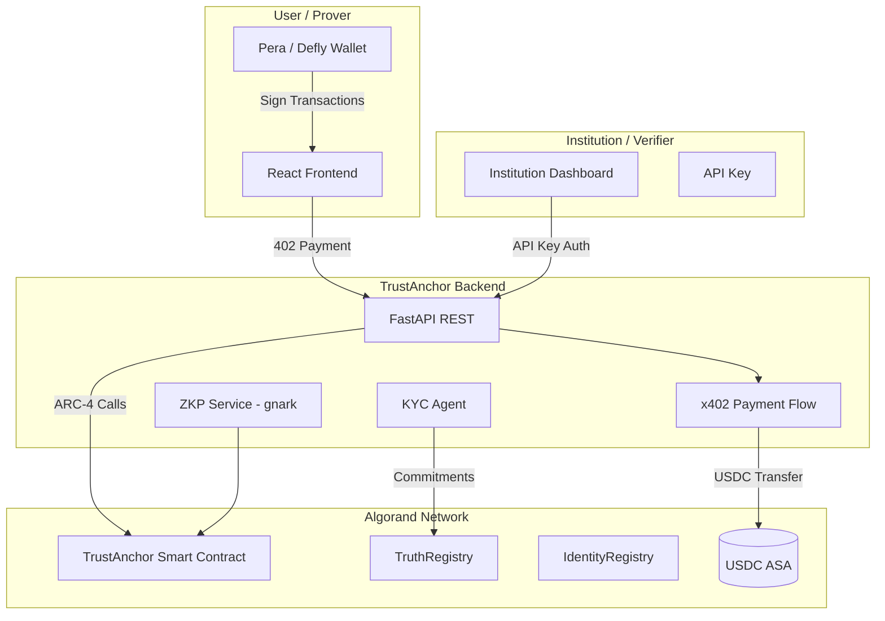
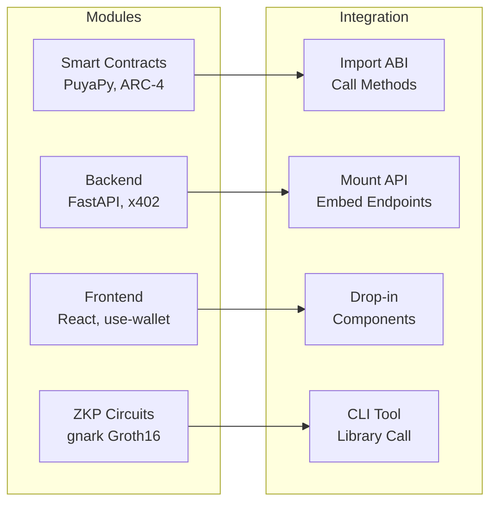
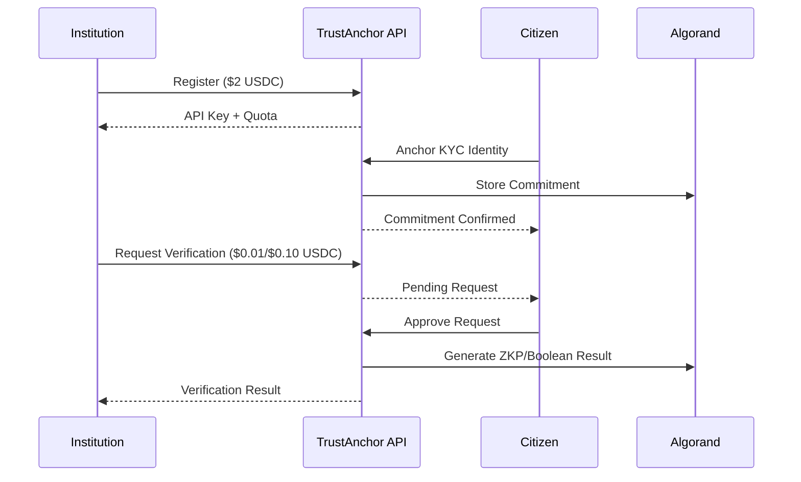

# TrustAnchor — Truth-as-a-Service on Algorand

**Institutions pay USDC. Users prove with ZKPs. Privacy preserved.**

TrustAnchor is a modular, privacy-preserving identity verification protocol on Algorand. Institutions (employers, DeFi protocols, lenders, governments) pay USDC to verify user attributes via zero-knowledge proofs — without ever seeing raw PII.

This is an **integration-ready module**. Each component (smart contracts, backend API, React frontend) can be used independently or embedded into existing dApps.

---

## Architecture





---

## Features

- **Institution Pays**: Verifiers bear the cost, not consumers. Matches real-world KYC (Onfido, Jumio, Persona).
- **x402 + USDC**: HTTP 402 payment flow with USDC asset transfers. Stable pricing for enterprise.
- **Zero-Knowledge Proofs**: Groth16 proofs via gnark. Prove income > threshold without revealing actual income.
- **Boolean Verification**: Simple yes/no threshold checks ($0.01 USDC per check).
- **Identity Anchoring**: KYC data committed to Algorand ledger via smart contract. Raw PII never stored.
- **Multi-type Institutions**: Bank, employer, DeFi protocol, exchange, lender, government, KYC provider.
- **Verification Requests**: On-chain tracking via BoxMap — institutions create, users approve.
- **Replay Protection**: Anti-replay txid tracking prevents payment reuse.
- **Smart Contracts**: PuyaPy (Algorand Python), ARC-4 ABI compliant, deployed on testnet/mainnet.
- **Wallet Integration**: Pera, Defly, Lute, Exodus via @txnlab/use-wallet-react v4.

---

## Protocol Flow



## Business Model

| Tier | Product | USDC | Who Pays |
|------|---------|------|----------|
| Boolean | "Is income > $50k?" yes/no | $0.01 | Institution |
| ZKP | Full zero-knowledge proof | $0.10 | Institution |
| Subscription | 1,000 verifications/month | $10/mo | Enterprise |
| Onboarding | Register on platform | $2 one-time | Institution |

### Why only USDC?
Enterprise buyers need stable, predictable pricing. ALGO is volatile. USDC (ASA `31566704` mainnet / `10458941` testnet) gives institutions fixed costs they can budget.

---

## Modular Architecture

| Module | Stack | Integration |
|--------|-------|-------------|
| **Contracts** | PuyaPy, ARC-4, BoxMap | Deploy standalone, call via ABI |
| **Backend** | FastAPI, x402, algosdk | Use as microservice or embed endpoints |
| **Frontend** | React 18, Tailwind, use-wallet v4 | Drop-in components for any dApp |
| **ZKP Circuits** | gnark (Go), Groth16 | CLI tool or library call |

```
TrustAnchor/
├── projects/
│   ├── TrustAnchor-contracts/   ← PuyaPy smart contracts
│   ├── TrustAnchor-backend/     ← FastAPI service with x402
│   └── TrustAnchor-frontend/    ← React + wallet integration
├── circuits/                    ← Groth16 ZKP prover
└── demo.py                      ← Headless demo
```

---

## Technical Stack

- **Smart Contracts**: Algorand Python (PuyaPy) — ARC-4, BoxMap, GlobalState
- **Cryptography**: gnark (Go-based ZKP engine, Groth16)
- **Backend**: FastAPI (Python 3.13), algosdk, httpx, x402-avm
- **Frontend**: React 18 (TypeScript), Tailwind CSS, @txnlab/use-wallet-react v4
- **Payments**: USDC ASA 10458941 (testnet) / 31566704 (mainnet)

---

## Quick Start

```bash
# 1. Install dependencies
algokit project bootstrap all

# 2. Compile ZKP prover
cd circuits && go build -o prover ./cmd/prover && ./prover setup --dir ./keys && cd ..

# 3. Start backend
cd projects/TrustAnchor-backend
cp .env.example .env  # configure USDC_ASSET_ID, TRUST_ANCHOR_ADDRESS
python -m uvicorn main:app --reload --port 8000

# 4. Launch frontend
cd projects/TrustAnchor-frontend
npm run dev
```

---

## Integration Guide

### As a Backend Microservice
```python
from TrustAnchor-backend.main import app
# Mount in your existing FastAPI app
```

### As Smart Contract Dependencies
```python
from algosdk.abi import Contract
# Load ARC-4 contract spec and call register_anchor, verify, etc.
```

### As Frontend Components
```tsx
import { TrustAnchorApp } from 'trustanchor-frontend'
// Embed in your dApp routing
```

### Headless Mode
```bash
python demo.py  # Run the full flow without a browser
```

---

## Docs

- [PROJECT.md](PROJECT.md) — Full technical documentation, API reference, architecture
- [USAGE.md](USAGE.md) — Quick-start guide and commands
- [CONTRACTS](projects/TrustAnchor-contracts/README.md) — Smart contract documentation
- [BACKEND](projects/TrustAnchor-backend/README.md) — API documentation
- [FRONTEND](projects/TrustAnchor-frontend/README.md) — Frontend documentation
