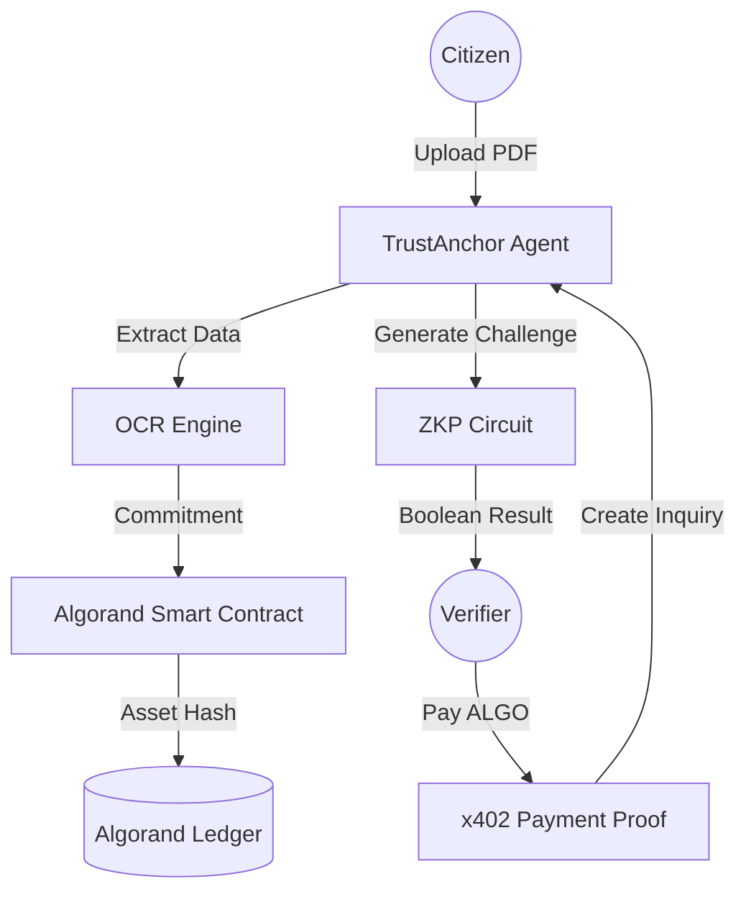

# TrustAnchor 🛡️⚓️
### *Privacy-Preserving Identity Sharding on Algorand*

**TrustAnchor** is a next-generation identity protocol that bridges the gap between real-world credentials and decentralized privacy. Built for **Hackseries 3.0**, it leverages Zero-Knowledge Proofs (ZKP) and the x402 Micropayment standard to enable "Truth-as-a-Service" without ever exposing a user's sensitive data.

---

## 🚀 The Vision
In the modern web, "Identity" is a liability. To prove you earn $50k or are 21+ years old, you currently have to hand over raw documents (PDFs, IDs) to untrusted third parties. 

**TrustAnchor solves this.** We "shard" your identity into cryptographic commitments on the Algorand blockchain. You provide the **Proof**, they get the **Truth**, but nobody sees the **Data**.

---

## ✨ Key Features
- **Identity Anchoring**: Securely commit KYC data (Income, Age, Nationality) to the Algorand ledger.
- **ZKP Verification**: Use Groth16 Zero-Knowledge proofs to verify attributes (e.g., "Income > $50,000") without revealing the exact value.
- **x402 Monetization**: Integrated Alogrand micropayments for every verification check. Verifiers pay a small fee in ALGO to access a cryptographic truth.
- **Cinematic Vault**: A premium, high-fidelity dashboard for citizens to manage their "Identity Assets."

---

## 🛠️ Technical Stack
- **Smart Contracts**: Algorand Python (Puya) & PuyaTS.
- **Cryptography**: `gnark` (Go-based ZKP engine utilizing Groth16).
- **Backend**: FastAPI (Python), `algosdk`, `pypdfum2`.
- **Frontend**: React (TypeScript), Tailwind CSS, Framer Motion.
- **Protocol**: x402 (Standardized Algorand Payment Proofs).

---

## 🏗️ Architecture



---

## 🛠️ Development & Setup

### Prerequisites
- [AlgoKit CLI](https://github.com/algorandfoundation/algokit-cli)
- [Docker](https://www.docker.com/)
- [Go](https://golang.org/) (for ZKP binary compilation)

### Initial Setup
1. **Bootstrap**: 
   ```bash
   algokit project bootstrap all
   ```
2. **Compile ZKP Prover**:
   Navigate to `/circuits` and build the `gnark` binary.
3. **Run Backend**:
   ```bash
   cd projects/TrustAnchor-backend
   python -m uvicorn main:app --reload --port 8000
   ```
4. **Launch Frontend**:
   ```bash
   cd projects/TrustAnchor-frontend
   npm run dev
   ```

---

## Docs

- [PROJECT.md](PROJECT.md) — Full technical documentation, API reference, architecture
- [USAGE.md](USAGE.md) — Quick-start guide and commands
